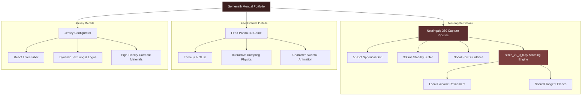
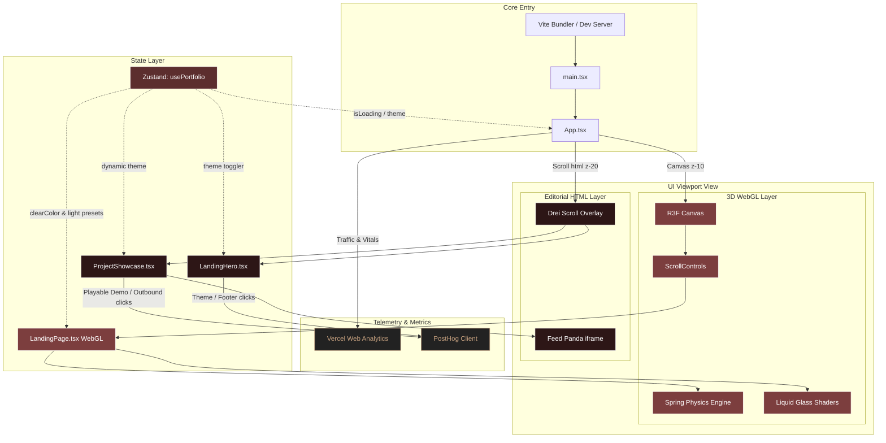

# Somenath Mondal — Portfolio Design System & Architecture
## The Premium Editorial 3D Experience (2026 Edition)

Welcome to the design and technical blueprint of Somenath Mondal's portfolio. This document details the visual guidelines, interactive philosophies, layout structures, and technical architecture of a portfolio designed to captivate visitors with digital art publication aesthetics, immersive WebGL environments, and solid full-stack engineering foundations.

---

## 1. Core Visual Design System (Theme: RedSands)

The portfolio utilizes **RedSands**, a custom premium dark editorial aesthetic inspired by luxurious fashion magazines, desert horizons, and high-contrast digital interfaces. It moves away from generic, clinical white/gray portfolios into a rich, deep, and ambient universe.

### 🎨 Color Palette & Contrast
*   **Primary Background**: `#3B1E1E` (Dark Reddish-Brown) — A rich, organic tone reminiscent of terracotta desert sands at midnight. It creates a warm, premium, and low-eye-strain canvas.
*   **Primary Text**: `#FFFFFF` (Bright White) — Maximum legibility and crisp contrast against the deep RedSands background.
*   **Supporting Typography**: `#D4AF37` / `#C5A07F` (Warm Metallic Sand & Copper Rose) — Sophisticated sand-accent tones used for borders, labels, and secondary details.
*   **Accent Lights**: Ambient warm amber and deep crimson highlights embedded inside the 3D materials.
*   **Glass Elements**: Transparent refractions featuring high transmission and subtle warmth to blend with the sandy red ambiance.

### 🔠 Typography
We pair high-contrast editorial serif headers with structural monospace/sans-serif technical descriptions.
*   **Primary Headers**: `Playfair Display` or `Cormorant Garamond` (Italic & Regular) — Evoking digital art exhibits and couture publications.
*   **Technical Copy**: `Inter` / `System Sans` — Perfectly legible, high-performance, clean, and modern.
*   **Metadata & Labels**: `JetBrains Mono` or `Courier New` — Demonstrating clean, engineering-focused precision.

### 🌊 Glassmorphic Refraction
All 3D interactive shapes (including the central **S** and **M** initials) utilize advanced **refraction physics**:
*   Built with `MeshTransmissionMaterial` in React Three Fiber (R3F).
*   **Characteristics**: High transmission (`0.95`), low roughness (`0.0`), subtle chromatic aberration (`0.8`), and a warm tint that gathers the `#3B1E1E` background colors and focuses them through lens-like deformation.

---

## 2. Interactive 3D Physics & Motion Architecture

### 🌀 Elastic Letters Physics
The center of the hero section is dominated by high-quality 3D "S" and "M" letters.
*   **Interactive Poking**: The mouse cursor acts as a physics force field. Moving the cursor near the letters applies a push vector, introducing dynamic rotational and positional displacements.
*   **Elastic Spring-Back**: Once the cursor leaves the active influence radius, an elastic spring equation calculates the return trajectory, creating a playful, tactile bounce.
*   **Mathematical Model**:
    $$\vec{F}_{\text{spring}} = -k \cdot (\vec{x} - \vec{x}_{\text{target}}) - c \cdot \vec{v}$$
    *Where $k$ is spring velocity, $c$ is damping, and $\vec{v}$ is the current velocity vector.*

### 🎛 Physics Debug Mode
*   Appended to the URL via `#debug`.
*   Instantiates a **Tweakpane** GUI for live parameter optimization:
    *   `letterSize` & `letterSpacing` (Responsive scale adjustments).
    *   `springVelocity`, `influenceRadius`, `damping`, and `pushForce`.
    *   Real-time frame rates and performance metrics powered by `r3f-perf`.

---

## 3. Featured Projects & Engineering Showcase

The portfolio showcases complex, high-tier software engineering achievements, moving far beyond basic CRUD applications.

### 🛰 A. Nestingale 360-Degree Capture & Stitching Pipeline
A state-of-the-art XR/VR capture framework designed to run seamlessly on mobile and specialized imaging hardware.

*   **Front-End Capture UI**:
    *   **50-Dot Spherical Grid**: Guides the user dynamically through a complete 3D capture sequence.
    *   **Stability Monitoring**: A real-time `300ms` stability buffer ensures crisp, blur-free exposure.
    *   **Nodal Point Guidance**: A strict `0.15m` physical pivot threshold ensures the user captures exactly around the nodal point of the camera lens, minimizing parallax errors.
*   **Stitching Engine (`stitch_v2_0_0.py`)**:
    *   An advanced Python-based image stitching system.
    *   **Local Pairwise Refinement**: Performs localized feature-matching and homography refinement on shared tangent planes.
    *   **OpenCV Workaround**: Solves the global loop closure failures common in standard OpenCV stitching pipelines by enforcing tangent plane geometry restraints.

### 🐼 B. Feed Panda (3D Browser Game)
An interactive web game showcasing advanced rendering, skeletal animation, and real-time browser physics.
*   **Gameplay**: Users launch highly-detailed 3D dumplings towards a reactive Kung Fu Panda character.
*   **Tech Stack**: Three.js, Vanilla JavaScript, and custom GLSL Shaders.
*   **Technical Highlight**: Optimized asset loading and custom vertex shaders simulating aerodynamic dumpling movement and physical collision responses.

### 👕 C. Jersey Configurator (3D Customization Platform)
An enterprise-grade 3D garment customization suite.
*   **Capabilities**: Real-time rendering of complex clothing patterns, high-fidelity fabric weaves (cotton, mesh, polyester), custom logo positioning, and dynamic material variations.
*   **Tech Stack**: React, Three.js, React Three Fiber (R3F), and Tailwind CSS.
*   **Technical Highlight**: Optimized PBR texture mapping and dynamic canvas generation to apply custom SVG/PNG logo graphics on deformed 3D geometries.

---

## 4. Editorial Layout & Navigation Journey

The portfolio follows a single-page scrolling structure with three high-impact zones, utilizing **ScrollControls** and **Framer Motion** for a luxurious magazine feel.

### 🏛 Zone 1: The RedSands Hero
*   **Visual Backdrop**: The ambient, dark reddish-brown (`#3B1E1E`) sky with a light grain shader overlay.
*   **Centerstage**: The floating, interactive glass **S** and **M** initials.
*   **Typography**: The name "Somenath Mondal" occupies the top-left in elegant italic serif, balanced by geographical coordinates and metadata in monospace.

### 🎞 Zone 2: The Editorial Portfolio Reel
*   As the user scrolls, the camera swings and slides downward, rotating to showcase a split-screen viewport.
*   **Layout**: Massive high-contrast project titles on the left, interactive 3D mockups or procedural WebGL canvases on the right.
*   **Nestingale Showcase**: A circular, interactive 50-dot WebGL sphere that reacts to mouse clicks, demonstrating the 360-degree capture grid live in the browser.

### 📬 Zone 3: Interactive CV & Contact Portal
*   **The CV Reveal**: An elegant, accordion-style technical breakdown of Somenath's development career, displaying past work with a cinematic "reveal" animation.
*   **Direct Inquiries**: A clean, minimalist contact form with floating input borders and soft glow indicators.

---

## 5. Performance Optimization & Best Practices

To deliver this high-fidelity experience smoothly across all devices, we strictly enforce the following engineering constraints:
1.  **DPR Capping**: Capped at `Math.min(window.devicePixelRatio, 1.5)` inside R3F's Canvas to prevent GPU bottlenecks on high-resolution displays.
2.  **Asset Prefetching**: Custom pre-loaders and suspension boundaries ensure all heavy 3D GLTF models, environment map textures, and custom fonts are cached before the loading screen fades.
3.  **Draw Call Management**: Merged geometries, texture atlasing, and lightweight post-processing shaders maintain a smooth 60fps even on mobile systems.

---

## 6. Core System Architecture

To ensure the portfolio scales across multiple aspect ratios (e.g. standard viewports, ultra-wide screens) and manages complex interactions gracefully, we implement a highly efficient **dual-layered rendering architecture**.

### 🏗 Architecture Map

### 🧱 Architectural Layer Breakdown

#### A. Host & Bundling Layer
*   Bundled using **Vite** via custom `vite.config.frontend.ts` for rapid, module-split compiling and automatic deployment via **Vercel** integration pipelines.

#### B. Global Reactive Store (Zustand)
*   **Store**: `usePortfolio.tsx`
*   Maintains simple, rapid global states (`theme: 'light' | 'dark'` and `isLoading`) preventing heavy prop-drilling.
*   Theme changes instantly trigger class updates in Tailwind while concurrently re-evaluating Three.js ambient colors and clear colors in the WebGL scene.

#### C. WebGL Canvas Layer (Three.js / React Three Fiber)
*   An absolute `z-10` stretched background canvas rendering elastic 3D typography (**S** & **M** initials) backed by transmission physics, custom fragment/vertex glass shaders, and dynamic studio lighting.
*   The Canvas explicitly limits DPR limits to `[1, 1.5]` to avoid fill-rate bottlenecks on Retina and Ultra-wide monitors.

#### D. Editorial HTML Scroll Overlay (Drei Scroll HTML)
*   Stretched boundaries (`width: 100%`) rendering high-impact typography and interactive project decks.
*   Z-index elevations (`z-20 pointer-events-auto` on links/buttons, `z-10 pointer-events-none` on background overlays) prevent pointer events from being absorbed, preserving clickability.
*   Dynamic inline showcases render games like *Feed Panda* cleanly within borderless iframes alongside visual `onError` image handlers for clean asset degradation.

#### E. Telemetry & Analytics Fabric
*   **Vercel Web Analytics**: Track core aggregates, layout speeds, and traffic locations.
*   **PostHog Telemetry**: Tracks granular events (`theme_toggled`, `playable_demo_started`, `playable_demo_closed`, `explore_demo_clicked`, `social_link_clicked`) enabling perfect user flow funnels and session logs.
    *   **Live Dashboard**: [Somenath Portfolio PostHog Dashboard](https://us.posthog.com/project/437135/dashboard/1621147)

> [!IMPORTANT]
> **Developer Requirement**: Before executing any git push or deployment commit, always confirm with the user whether the architecture blueprint diagrams in `DESIGN.md` and `GEMINI.md` require updates.
